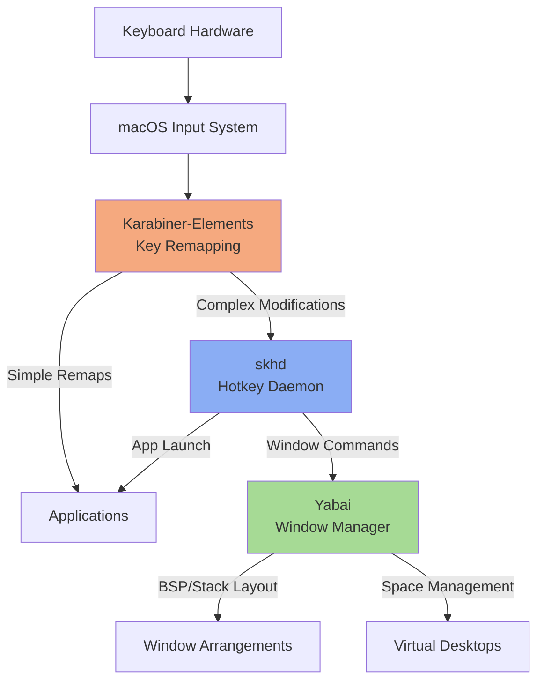
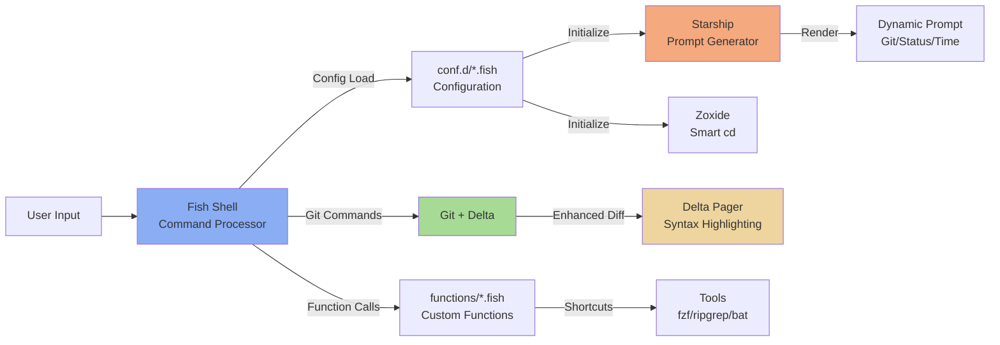
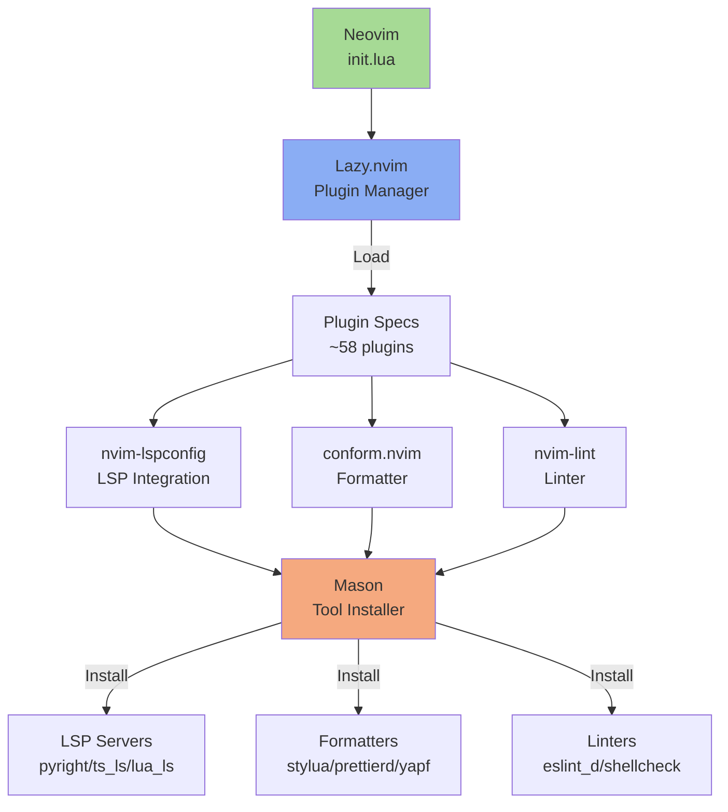
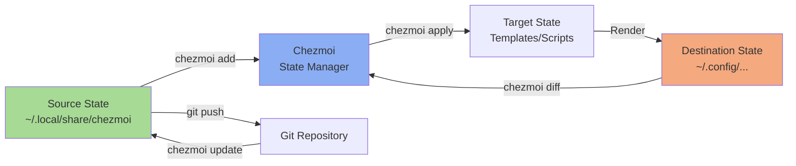
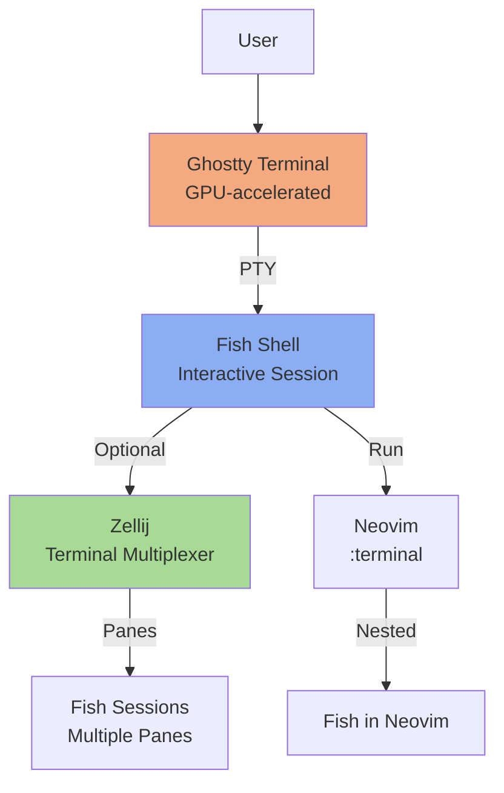
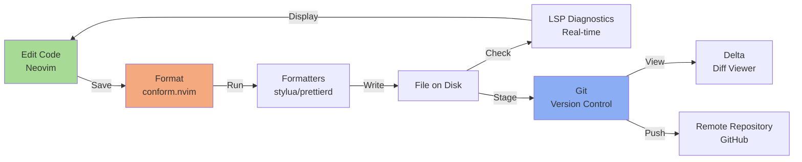
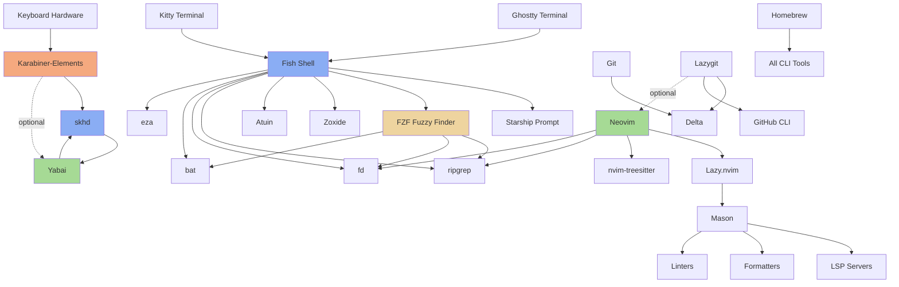

# System Architecture

This document provides a comprehensive overview of the dotfiles system architecture, showing how various tools and components interact to create a cohesive development environment.

## Table of Contents

- [Overview](#overview)
- [Layer Interactions](#layer-interactions)
- [Diagram 1: Keyboard Input Flow](#diagram-1-keyboard-input-flow)
  - [Component Roles](#component-roles)
  - [Data Flow](#data-flow)
- [Diagram 2: Shell Environment Flow](#diagram-2-shell-environment-flow)
  - [Component Roles](#component-roles-1)
  - [Data Flow](#data-flow-1)
- [Diagram 3: Neovim Toolchain](#diagram-3-neovim-toolchain)
  - [Component Roles](#component-roles-2)
  - [Data Flow](#data-flow-2)
- [Diagram 4: Chezmoi Workflow](#diagram-4-chezmoi-workflow)
  - [Component Roles](#component-roles-3)
  - [Data Flow](#data-flow-3)
- [Diagram 5: Terminal Multiplexing Stack](#diagram-5-terminal-multiplexing-stack)
  - [Component Roles](#component-roles-4)
  - [Data Flow](#data-flow-4)
- [Diagram 6: Development Workflow Integration](#diagram-6-development-workflow-integration)
  - [Component Roles](#component-roles-5)
  - [Data Flow](#data-flow-5)
- [Integration Points](#integration-points)
  - [Karabiner ↔ skhd ↔ Yabai](#karabiner--skhd--yabai)
  - [Fish ↔ Starship ↔ Git](#fish--starship--git)
  - [Neovim ↔ Mason ↔ LSP](#neovim--mason--lsp)
  - [Chezmoi ↔ Git](#chezmoi--git)
- [System Dependency Tree](#system-dependency-tree)
  - [Dependency Graph](#dependency-graph)
  - [Tool Dependencies by Category](#tool-dependencies-by-category)
  - [Service Startup Order](#service-startup-order)
  - [Circular Dependencies](#circular-dependencies)
  - [Optional Dependencies](#optional-dependencies)
  - [Missing Dependencies Detection](#missing-dependencies-detection)
- [System Dependencies](#system-dependencies)
  - [Core Tools](#core-tools)
  - [Window Management](#window-management)
  - [Terminal](#terminal)
  - [Shell Enhancement](#shell-enhancement)
  - [Development](#development)
  - [Language Tools (via Mason)](#language-tools-via-mason)
- [Configuration File Locations](#configuration-file-locations)
- [Performance Considerations](#performance-considerations)
  - [Startup Optimization](#startup-optimization)
  - [Resource Usage](#resource-usage)
  - [Scalability](#scalability)
- [Security Considerations](#security-considerations)
  - [Secrets Management](#secrets-management)
  - [Permissions](#permissions)
- [Maintenance](#maintenance)
  - [Updates](#updates)
  - [Debugging](#debugging)
  - [Backup](#backup)
- [Future Enhancements](#future-enhancements)
  - [Planned Improvements](#planned-improvements)
  - [Experimental Features](#experimental-features)
- [References](#references)

## Overview

The system is built around several key layers:

1. **Input Layer**: Keyboard input processing (Karabiner → skhd → Yabai)
2. **Shell Layer**: Interactive shell environment (Fish → Starship → Zoxide)
3. **Editor Layer**: Neovim with plugin ecosystem (Lazy.nvim → Plugins → LSPs)
4. **Terminal Layer**: Terminal emulation (Ghostty/Kitty → Shell)
5. **Configuration Management**: Chezmoi for dotfile state management
6. **Version Control**: Git with Delta for enhanced diffs

## Layer Interactions

The layers interact through well-defined interfaces:

- **Keyboard events** flow from hardware → macOS → Karabiner → skhd → Yabai
- **Shell commands** are processed by Fish, enhanced by Starship prompts and Zoxide navigation
- **File operations** in Neovim trigger LSP servers, formatters, and linters via Mason
- **Configuration changes** are managed through Chezmoi's source → target → destination flow
- **Git operations** are visualized through Delta's syntax highlighting and side-by-side diffs

---

## Diagram 1: Keyboard Input Flow

This diagram shows how keyboard input is processed through multiple layers before reaching the window manager and applications.



### Component Roles

- **Karabiner-Elements**: Low-level key remapping (e.g., Alt+h/j/k/l → Arrow keys in terminal)
- **skhd**: Binds key combinations to shell commands (e.g., Ctrl+Alt+h → focus west window)
- **Yabai**: Tiling window manager that executes layout and space commands
- **Integration**: Karabiner handles key translation, skhd triggers Yabai commands for window management

### Data Flow

1. Hardware keyboard sends key event to macOS
2. Karabiner intercepts and remaps keys based on application context
3. skhd receives hotkey combinations and executes configured shell commands
4. Yabai receives commands via CLI and updates window layouts/spaces
5. macOS renders the resulting window arrangement

---

## Diagram 2: Shell Environment Flow

This diagram illustrates the interactive shell environment and how various tools enhance the user experience.



### Component Roles

- **Fish Shell**: Modern shell with auto-suggestions, syntax highlighting, and superior scripting
- **Starship**: Fast, customizable prompt showing git status, duration, directory, language versions
- **Zoxide**: Learns frequently used directories for intelligent `cd` replacement
- **Git + Delta**: Version control with side-by-side diffs and syntax-highlighted output
- **Custom Functions**: 70+ Fish functions for productivity (cm, lg, rg_fzf_search, etc.)

### Data Flow

1. User enters command in Fish shell
2. Fish loads configuration from `conf.d/` (Starship, Zoxide, FZF, etc.)
3. Starship generates prompt with git branch, status, and metadata
4. Fish executes command, potentially calling custom functions
5. Git operations are piped through Delta for enhanced visualization
6. Results are displayed with syntax highlighting and formatting

---

## Diagram 3: Neovim Toolchain

This diagram shows the Neovim plugin ecosystem and how LSP servers, formatters, and linters are managed.



### Component Roles

- **Neovim**: Core editor with Lua-based configuration
- **Lazy.nvim**: Plugin manager with lazy loading and dependency resolution
- **nvim-lspconfig**: Configures LSP servers for code intelligence (completion, diagnostics, etc.)
- **conform.nvim**: Code formatting orchestrator (stylua, prettierd, yapf, shfmt)
- **Mason**: Unified installer for LSP servers, formatters, and linters
- **LSP Servers**: Language-specific servers (pyright, ts_ls, lua_ls, rust-analyzer, etc.)

### Data Flow

1. Neovim starts and loads `init.lua`
2. Lazy.nvim reads plugin specifications from `lua/plugins/*.lua`
3. Plugins are lazy-loaded based on file type and events
4. nvim-lspconfig attaches LSP servers to buffers
5. Mason ensures required tools are installed
6. On save, conform.nvim runs formatters in sequence
7. LSP servers provide real-time diagnostics, completion, and goto-definition

---

## Diagram 4: Chezmoi Workflow

This diagram shows how Chezmoi manages dotfile state across source, target, and destination.



### Component Roles

- **Source State**: The Git-tracked directory (`~/.local/share/chezmoi`) containing templates
- **Chezmoi**: State manager that processes templates and applies transformations
- **Target State**: The computed state after template rendering
- **Destination State**: Actual dotfiles in home directory (`~/.config`, `~/.gitconfig`, etc.)

### Data Flow

1. Edit files in source state with `chezmoi edit <file>`
2. Chezmoi renders templates (processing `.tmpl` files, running scripts)
3. `chezmoi diff` shows changes between target and destination
4. `chezmoi apply` writes target state to destination
5. `git commit` and `git push` version control changes
6. `chezmoi update` pulls and applies remote changes

---

## Diagram 5: Terminal Multiplexing Stack

This diagram shows the terminal emulation and multiplexing layers.



### Component Roles

- **Ghostty**: Modern GPU-accelerated terminal emulator (primary)
- **Fish Shell**: Interactive shell with syntax highlighting and auto-suggestions
- **Zellij**: Rust-based terminal multiplexer (alternative to tmux)
- **Neovim Terminal**: Embedded terminal for running commands without leaving editor

### Data Flow

1. Ghostty terminal starts and spawns Fish shell
2. User optionally starts Zellij for pane management
3. Zellij creates multiple panes, each running Fish
4. Neovim can open embedded terminals (`:terminal`)
5. All terminals support full color, Unicode, and custom key bindings

---

## Diagram 6: Development Workflow Integration

This diagram shows the complete development workflow from editing to version control.



### Component Roles

- **Neovim**: Primary code editor with LSP integration
- **conform.nvim**: Automatically formats code on save
- **Formatters**: Language-specific formatters (stylua for Lua, prettierd for JS/TS)
- **LSP**: Provides real-time diagnostics, linting, and code intelligence
- **Git**: Version control system
- **Delta**: Enhances git diff output with syntax highlighting and side-by-side view

### Data Flow

1. Developer edits code in Neovim
2. On save, conform.nvim triggers configured formatters
3. Formatters process the file and write formatted version
4. LSP servers analyze the file and provide diagnostics
5. Developer stages changes with `git add`
6. `git diff` shows changes via Delta pager
7. `git commit` creates a commit
8. `git push` sends changes to remote repository

---

## Integration Points

### Karabiner ↔ skhd ↔ Yabai

- **Karabiner** remaps keys at the lowest level (e.g., Alt+h → Left Arrow in terminals)
- **skhd** receives the remapped keys and executes Yabai commands
- **Yabai** receives commands via CLI and manages window layouts
- **Example**: `Ctrl+Alt+h` → skhd → `yabai -m window --focus west`

### Fish ↔ Starship ↔ Git

- **Fish** initializes Starship in `config.fish` via `starship init fish | source`
- **Starship** reads `starship.toml` and generates custom prompt
- **Git** provides status information (branch, dirty state) to Starship
- **Example**: Prompt shows `[█▓▒  ~/dotfiles   develop]` with git branch

### Neovim ↔ Mason ↔ LSP

- **Neovim** loads plugin specs via Lazy.nvim
- **Mason** ensures LSP servers are installed (`pyright`, `lua_ls`, `ts_ls`, etc.)
- **nvim-lspconfig** attaches LSP servers to buffers based on filetype
- **Example**: Opening `config.lua` → Mason ensures `lua_ls` is installed → LSP provides completion

### Chezmoi ↔ Git

- **Chezmoi** source directory is a Git repository
- **Git** tracks all dotfile changes
- **Workflow**: `chezmoi edit` → modify → `chezmoi diff` → `chezmoi apply` → `git commit`
- **Example**: Edit `.gitconfig` template → apply → commit to version control

---

## System Dependency Tree

This section documents the complete dependency tree showing what tools depend on what, including service dependencies and startup order requirements.

### Dependency Graph



### Tool Dependencies by Category

#### Hardware Input Layer

- **Karabiner-Elements**: No dependencies (operates at hardware level)
  - Remaps physical keys before any other software sees them
  - Works independently of all other tools

#### Window Management Layer

- **skhd**: Depends on Yabai (to control), uses Karabiner output (for hardware keys)
  - Receives key events from Karabiner
  - Sends window management commands to Yabai
  - Can launch applications independently
- **Yabai**: Depends on skhd (for hotkeys), optional Karabiner integration
  - Requires skhd for keyboard-driven window management
  - Uses Karabiner-remapped keys indirectly through skhd
  - Requires macOS accessibility permissions
  - Requires partial SIP disable for Scripting Addition features

#### Shell Environment

- **Fish**: Depends on Starship, FZF, ripgrep, fd, bat, eza, Zoxide, Atuin
  - **Starship**: Cross-shell prompt (required for prompt display)
  - **FZF**: Fuzzy finder (used in custom functions and keybindings)
  - **ripgrep**: Fast text search (used in FZF previews and custom functions)
  - **fd**: Fast file finder (used in FZF and custom functions)
  - **bat**: Syntax-highlighted cat (used in FZF previews)
  - **eza**: Modern ls replacement (used in custom functions)
  - **Zoxide**: Smart directory jumper (initialized in Fish config)
  - **Atuin**: Shell history sync (optional, initialized in Fish config)

#### Terminal Emulators

- **Ghostty**: No dependencies (primary terminal)
  - GPU-accelerated terminal emulator
  - Spawns Fish shell on startup
- **Kitty**: No dependencies (alternative terminal)
  - GPU-accelerated terminal emulator
  - Configured for Karabiner integration

#### Editor Environment

- **Neovim**: Depends on LSP servers, Treesitter, ripgrep, fd, Mason, Lazy.nvim
  - **Lazy.nvim**: Plugin manager (required for all plugins)
  - **Mason**: Tool installer for LSP servers, formatters, linters
  - **LSP Servers**: Language-specific servers installed via Mason
    - `bash-language-server`, `lua-language-server`, `typescript-language-server`
    - `pyright`, `rust-analyzer`, `json-lsp`, `marksman`
  - **Formatters**: Code formatters installed via Mason
    - `stylua`, `prettierd`, `yapf`, `shfmt`, `shellcheck`
  - **nvim-treesitter**: Syntax parsing (downloads language parsers)
  - **ripgrep**: Fast searching in Neovim telescope/grep plugins
  - **fd**: File finding in Neovim telescope plugin

#### Git Tooling

- **Git**: Core version control (no dependencies)
- **Delta**: Depends on Git (syntax-highlighted diff pager)
  - Enhanced diff viewer configured in `.gitconfig`
  - Used by Git and Lazygit
- **Lazygit**: Depends on Delta, GitHub CLI, optional Neovim
  - **Delta**: For enhanced diff viewing
  - **GitHub CLI (gh)**: For PR/issue management
  - **Neovim**: Optional integration via `nvr` for file editing

#### Fuzzy Finding

- **FZF**: Depends on ripgrep, fd, bat for previews
  - **ripgrep**: Content searching for live grep
  - **fd**: File finding
  - **bat**: Syntax-highlighted file previews

#### Package Management

- **Homebrew**: Installs all CLI tools
  - Core package manager that bootstraps everything
  - Installed first by chezmoi scripts

### Service Startup Order

Based on chezmoi script execution and service dependencies:

1. **Homebrew Installation** (`run_once_after_1-install-homebrew.sh`)
   - Installs Homebrew package manager
   - Runs `brew bundle` to install all packages from Brewfile
   - Must complete before any other tools are available

2. **Additional Tools Installation** (`run_once_after_2-install-various.sh`)
   - Installs Rust via rustup
   - Installs npm packages (typescript-language-server, claude-code)
   - Installs cargo packages (various CLI tools)
   - Installs Go packages (various CLI tools)
   - Installs Hammerspoon, Cursor, Ghostty (local machines only)

3. **Python Tools Installation** (`run_once_after_3-install-uv-tools.sh.tmpl`)
   - Installs Python 3.13 via uv
   - Installs Python CLI tools specified in `.chezmoidata/uv.toml`

4. **macOS Settings** (`run_once_after_4-macos-settings.sh`)
   - Configures macOS system preferences
   - Sets key repeat rates, disables font smoothing, etc.

5. **Fish Shell Setup** (`run_after_1-setup-fish.sh`)
   - Links Fisher plugin directories
   - Runs on every `chezmoi apply` to maintain state

#### Runtime Service Dependencies

Once installed, services start in this order:

1. **Karabiner-Elements** (launched at login)
   - Must start before any keyboard input is processed
   - Runs as a system service via `brew services`

2. **skhd** (launched at login)
   - Starts after Karabiner to receive remapped keys
   - Runs as a system service via `brew services`

3. **Yabai** (launched at login)
   - Starts after skhd to receive window management commands
   - Loads Scripting Addition with sudo (requires sudoers config)
   - Runs as a system service via `brew services`

4. **Ghostty/Terminal Emulator** (user-launched)
   - Spawns Fish shell on startup
   - Fish initializes Starship, Zoxide, FZF, Atuin

5. **Neovim** (user-launched)
   - Lazy.nvim loads plugins on-demand
   - Mason ensures LSP servers are installed
   - LSP servers start when relevant files are opened

### Circular Dependencies

#### skhd ↔ Yabai

- **skhd** controls Yabai via commands
- **Yabai** requires skhd for keyboard-driven management
- **Resolution**: Both services run independently; skhd sends CLI commands to Yabai

#### Fish ↔ FZF ↔ ripgrep/fd/bat

- **Fish** provides the shell environment for FZF
- **FZF** is used in Fish custom functions and keybindings
- **Resolution**: All are independent tools; Fish integrates FZF via plugins

### Optional Dependencies

Tools that enhance functionality but aren't required:

- **Atuin**: Shell history sync (Fish works without it)
- **Zoxide**: Smart directory jumping (Fish `cd` works without it)
- **Karabiner**: Key remapping (skhd works with default keys)
- **Yabai Scripting Addition**: Advanced features (basic tiling works without SIP disable)
- **Neovim Remote (nvr)**: Lazygit-Neovim integration (Lazygit works with any editor)
- **GitHub CLI (gh)**: Lazygit GitHub features (git operations work without it)

### Missing Dependencies Detection

If a dependency is missing, tools degrade gracefully:

- **FZF without ripgrep**: Falls back to `find` for file search
- **FZF without bat**: Shows plain text previews
- **Neovim without Mason**: Plugins still work, manual LSP server installation needed
- **Yabai without skhd**: Can be controlled via CLI, no hotkeys
- **Fish without Starship**: Uses default prompt
- **Lazygit without Delta**: Uses standard git diff output

---

## System Dependencies

### Core Tools

- **macOS**: Operating system (Darwin kernel)
- **Homebrew**: Package manager for installing tools
- **Git**: Version control system
- **Fish**: Interactive shell
- **Neovim**: Text editor

### Window Management

- **Karabiner-Elements**: Key remapping
- **skhd**: Hotkey daemon
- **Yabai**: Tiling window manager

### Terminal

- **Ghostty**: GPU-accelerated terminal emulator
- **Zellij**: Terminal multiplexer (optional)

### Shell Enhancement

- **Starship**: Cross-shell prompt
- **Zoxide**: Smart directory jumper
- **fzf**: Fuzzy finder
- **ripgrep**: Fast grep alternative
- **bat**: Cat with syntax highlighting
- **eza**: Modern ls replacement

### Development

- **Lazy.nvim**: Neovim plugin manager
- **Mason**: LSP/formatter/linter installer
- **Delta**: Git diff pager
- **Chezmoi**: Dotfile manager

### Language Tools (via Mason)

- **Python**: pyright, yapf, ruff
- **JavaScript/TypeScript**: ts_ls, prettierd, eslint_d
- **Lua**: lua_ls, stylua
- **Rust**: rust-analyzer
- **Shell**: bash-language-server, shfmt, shellcheck
- **Markdown**: marksman, markdownlint-cli2

---

## Configuration File Locations

```
~/.local/share/chezmoi/          # Chezmoi source directory
├── dot_config/
│   ├── fish/                    # Fish shell configuration
│   │   ├── config.fish          # Main config
│   │   ├── conf.d/              # Config modules
│   │   └── functions/           # Custom functions
│   ├── starship.toml            # Starship prompt config
│   ├── skhd/skhdrc              # skhd hotkey bindings
│   ├── yabai/yabairc            # Yabai window manager config
│   ├── karabiner/               # Karabiner key remapping
│   └── delta/                   # Delta diff theming
├── dot_gitconfig                # Git configuration
└── docs/                        # Documentation (this file)

~/.config/nvim/                  # Neovim config (not in chezmoi)
├── init.lua                     # Entry point
├── lua/
│   ├── config/lazy.lua          # Lazy.nvim setup
│   └── plugins/                 # Plugin specifications
```

---

## Performance Considerations

### Startup Optimization

- **Fish**: Fast startup (~50ms) with modular config loading
- **Starship**: Parallel module execution for quick prompt rendering
- **Neovim**: Lazy loading plugins based on filetype and events
- **Zoxide**: Async database updates to avoid blocking shell

### Resource Usage

- **Yabai**: Lightweight window manager with minimal CPU usage
- **LSP Servers**: Run in background, only active when editing relevant files
- **Delta**: Pagination prevents memory issues with large diffs
- **Ghostty**: GPU acceleration reduces CPU usage for rendering

### Scalability

- **Chezmoi**: Handles hundreds of dotfiles efficiently
- **Mason**: Concurrent tool installation
- **Git**: Large repository support with proper `.gitignore`
- **Fish**: Handles thousands of history entries without slowdown

---

## Security Considerations

### Secrets Management

- **Chezmoi**: Supports encrypted files and template-based secrets
- **Git**: Secrets excluded via `.gitignore`
- **Environment Variables**: Loaded from excluded `.env` files
- **SSH Keys**: Managed separately, not in dotfiles

### Permissions

- **Yabai**: Requires sudo access for Scripting Addition (SIP-disabled)
- **skhd**: Requires Accessibility permissions
- **Karabiner**: Requires Input Monitoring permissions
- **Scripts**: Executable permissions managed by Chezmoi

---

## Maintenance

### Updates

- **Homebrew**: `brew update && brew upgrade`
- **Chezmoi**: `chezmoi update` (pulls from Git remote)
- **Neovim Plugins**: Lazy.nvim auto-checks for updates
- **Mason Tools**: `:Mason` shows available updates

### Debugging

- **Fish**: `fish_config` for web-based debugging
- **Starship**: `starship timings` for performance profiling
- **Neovim**: `:checkhealth` for diagnostics
- **Yabai**: `yabai -m query --windows` for state inspection
- **Git**: `git config --list` to verify configuration

### Backup

- **Dotfiles**: Version controlled in Git, pushed to GitHub
- **Neovim Config**: Separate Git repository
- **Secrets**: Stored in encrypted 1Password vault
- **Application Data**: Time Machine backups

---

## Future Enhancements

### Planned Improvements

- **Nix/Home Manager**: Declarative package management (alternative to Homebrew)
- **Ansible**: Automated macOS setup and app installation
- **Claude MCP**: Integration with Claude AI for enhanced development workflow
- **Custom Status Bar**: SketchyBar for macOS menu bar replacement
- **Enhanced Notifications**: Notification center integration for build/test results

### Experimental Features

- **Wezterm**: Alternative GPU-accelerated terminal (currently using Ghostty)
- **Helix**: Modal editor as Neovim alternative
- **Nushell**: Structured data shell (Fish alternative)
- **Atuin**: Shell history sync across machines

---

## References

- [Chezmoi Documentation](https://www.chezmoi.io/)
- [Fish Shell Documentation](https://fishshell.com/docs/current/)
- [Starship Documentation](https://starship.rs/)
- [Neovim Documentation](https://neovim.io/doc/)
- [Yabai Documentation](https://github.com/koekeishiya/yabai)
- [Karabiner-Elements Documentation](https://karabiner-elements.pqrs.org/)
- [LazyVim Documentation](https://www.lazyvim.org/)
