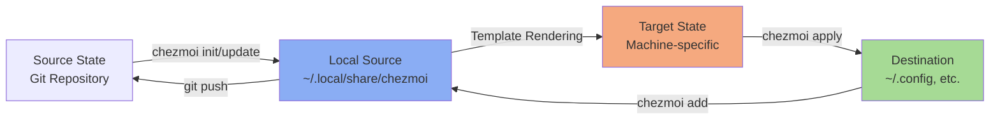

# Multi-Machine Synchronization

## Purpose

This workflow explains how to manage dotfiles across multiple machines using chezmoi's template system, machine-specific variables, and synchronization capabilities. Use this workflow when you need to:

- Maintain consistent configurations across multiple computers (work laptop, personal desktop, remote servers)
- Apply machine-specific customizations while sharing the same dotfiles repository
- Keep configurations in sync as you make changes on different machines
- Handle conflicts when the same file is modified on multiple machines
- Conditionally include/exclude configurations based on machine attributes

## Prerequisites

- [x] Chezmoi installed on all machines (v2.0.0 or later)
- [x] Git repository for dotfiles accessible from all machines
- [x] Basic understanding of Go text templates (used by chezmoi)
- [x] SSH or HTTPS access to your dotfiles repository
- [x] Consistent Git credentials configured across machines

## Architecture Overview

Chezmoi uses a **three-state model** for managing dotfiles across machines:



**Key concepts**:

- **Source State**: Git repository containing templates and scripts (shared across machines)
- **Local Source**: Machine-specific copy of source state in `~/.local/share/chezmoi`
- **Target State**: Computed files after template rendering (machine-specific)
- **Destination State**: Actual dotfiles in your home directory

## Machine-Specific Template System

### Template File Naming

Chezmoi recognizes files with the `.tmpl` extension as templates and processes them through Go's text/template engine:

```bash
# Source file (in ~/.local/share/chezmoi)
dot_config/fish/config.fish.tmpl

# Destination file (in ~/)
~/.config/fish/config.fish
```

**Naming patterns**:

- `.tmpl` suffix: File is a template, will be rendered before applying
- `dot_` prefix: Becomes `.` in destination (e.g., `dot_gitconfig` → `.gitconfig`)
- `private_` prefix: Sets file permissions to 0600 (user read/write only)
- `encrypted_` prefix: File is GPG-encrypted in source state
- `symlink_` prefix: Creates symlink instead of regular file
- Combine prefixes: `private_encrypted_dot_ssh/config.tmpl`

### Available Template Variables

Chezmoi provides several built-in variables for machine detection:

```go
// Operating system
{{ .chezmoi.os }}              // "darwin", "linux", "windows"
{{ .chezmoi.osRelease.id }}    // "ubuntu", "arch", etc.

// Hardware
{{ .chezmoi.arch }}            // "amd64", "arm64"
{{ .chezmoi.hostname }}        // Machine hostname

// User info
{{ .chezmoi.username }}        // Current username
{{ .chezmoi.homeDir }}         // Home directory path

// Paths
{{ .chezmoi.sourceDir }}       // ~/.local/share/chezmoi
{{ .chezmoi.cacheDir }}        // ~/.cache/chezmoi
{{ .chezmoi.configFile }}      // ~/.config/chezmoi/chezmoi.toml
```

**Example usage**:

```fish
# config.fish.tmpl
{{ if eq .chezmoi.os "darwin" }}
# macOS-specific configuration
set -gx BROWSER open
{{ else if eq .chezmoi.os "linux" }}
# Linux-specific configuration
set -gx BROWSER firefox
{{ end }}
```

### Custom Variables with .chezmoidata/

Store custom machine-specific data in `.chezmoidata/` directory using TOML, JSON, or YAML:

**Directory structure**:

```
~/.local/share/chezmoi/
├── .chezmoidata/
│   ├── constants.toml        # Shared constants across all machines
│   ├── uv.toml               # Python tool configurations
│   └── hostname.toml         # Machine-specific overrides
```

**Example: `.chezmoidata/constants.toml`**:

```toml
[path]
ctrld_configs = "/cm-util/ctrld-configs"
secrets = "/secrets"
templates = "/.chezmoitemplates"
```

**Example: `.chezmoidata/uv.toml`**:

```toml
[uv]
tools = [
    { name = "ruff", version = "latest" },
    { name = "yapf", version = "latest" },
    { name = "aider-chat", version = "latest" },
]
```

**Accessing in templates**:

```bash
# symlink_Brewfile.tmpl
{{ .chezmoi.sourceDir }}{{ .path.ctrld_configs }}/homebrew/Brewfile
```

### Dynamic Variables with .chezmoi.toml.tmpl

The chezmoi configuration file itself can be a template, allowing you to prompt for machine-specific values during initialization:

**Example: `.chezmoi.toml.tmpl`**:

```toml
# Prompt for secrets repo URL
{{ $secretsRepo := promptString "Enter git@github.com URL to optional repo containing dotfile secrets" -}}

# Prompt for passphrase
{{ $passphrase := promptStringOnce . "passphrase" "passphrase" -}}

encryption = "gpg"

[edit]
    apply = true  # apply changes on exit
    watch = true  # apply changes on save

[git]
    autoCommit = false
    autoPush = false
    autoAdd = true

[onepassword]
    mode = "service"

[data]
    passphrase = {{ $passphrase | quote }}
    secretsRepo = {{ $secretsRepo | quote }}

[gpg]
    symmetric = true
    args = ["--batch", "--passphrase", {{ $passphrase | quote }}, "--no-symkey-cache"]
```

**Variables set here** are accessible in all templates via `.passphrase` and `.secretsRepo`.

## Common Template Patterns

### Conditional Configuration by OS

```fish
# config.fish.tmpl
{{ if eq .chezmoi.os "darwin" }}
# macOS: Use Homebrew paths
set -gx PATH /opt/homebrew/bin $PATH
{{ else if eq .chezmoi.os "linux" }}
# Linux: Use system package paths
set -gx PATH /usr/local/bin $PATH
{{ end }}
```

### Conditional Configuration by Hostname

```fish
# config.fish.tmpl
{{ if eq .chezmoi.hostname "work-laptop" }}
# Work-specific configuration
set -gx WORK_ENV production
set -gx AWS_PROFILE company-prod
{{ else if eq .chezmoi.hostname "personal-desktop" }}
# Personal-specific configuration
set -gx WORK_ENV development
set -gx AWS_PROFILE personal
{{ end }}
```

### Architecture-Specific Paths

```bash
# .bashrc.tmpl
{{ if eq .chezmoi.arch "arm64" }}
export HOMEBREW_PREFIX="/opt/homebrew"
{{ else }}
export HOMEBREW_PREFIX="/usr/local"
{{ end }}
export PATH="${HOMEBREW_PREFIX}/bin:$PATH"
```

### Symlinks to Machine-Specific Files

```bash
# symlink_dot_my.gitconfig.tmpl
{{- $myGitConfig := (joinPath .chezmoi.sourceDir .path.secrets "private_dot_my.gitconfig") -}}
{{ if stat $myGitConfig }}
{{ $myGitConfig }}
{{ end }}
```

This creates a symlink `~/.my.gitconfig` → `~/.local/share/chezmoi/secrets/private_dot_my.gitconfig` only if the file exists.

### Multi-Value Selection

```toml
# config.toml.tmpl
{{ if or (eq .chezmoi.hostname "laptop") (eq .chezmoi.hostname "desktop") }}
[display]
hidpi = true
{{ else }}
[display]
hidpi = false
{{ end }}
```

### Default Values with Fallback

```fish
# config.fish.tmpl
{{- $editor := "vim" -}}
{{ if eq .chezmoi.os "darwin" }}
{{- $editor = "nvim" -}}
{{ end }}
set -gx EDITOR {{ $editor }}
```

## Synchronization Workflow

### Initial Setup on First Machine

1. **Initialize chezmoi with your dotfiles repository**:

   ```bash
   # Using HTTPS
   chezmoi init https://github.com/username/dotfiles.git

   # Using SSH (recommended)
   chezmoi init git@github.com:username/dotfiles.git
   ```

2. **Answer prompts** (if `.chezmoi.toml.tmpl` has `promptString` calls):

   ```
   Enter git@github.com URL to optional repo containing dotfile secrets: git@github.com:username/secrets.git
   passphrase: ********
   ```

3. **Review what would be applied**:

   ```bash
   chezmoi diff
   ```

4. **Apply the dotfiles**:

   ```bash
   chezmoi apply
   ```

5. **Verify everything works** on this machine before pushing changes.

### Setup on Additional Machines

1. **Initialize on the new machine**:

   ```bash
   chezmoi init git@github.com:username/dotfiles.git
   ```

2. **Templates will be rendered with new machine's variables**:
   - Different hostname → different conditional blocks
   - Different OS → different paths and tools
   - Different architecture → different binaries

3. **Preview machine-specific rendering**:

   ```bash
   # See what templates would produce
   chezmoi cat ~/.config/fish/config.fish

   # Compare with what's currently in home directory
   chezmoi diff
   ```

4. **Apply configurations**:

   ```bash
   chezmoi apply
   ```

5. **Test machine-specific configurations** work correctly.

### Making Changes and Syncing

**Scenario 1: Edit on Machine A, sync to Machine B**

**On Machine A**:

```bash
# Edit configuration
chezmoi edit ~/.config/fish/config.fish

# Preview changes
chezmoi diff

# Apply locally
chezmoi apply

# Test that it works
fish

# Commit and push
chezmoi cd
git add dot_config/fish/config.fish
git commit -m "feat: add new fish alias for git log"
git push
exit
```

**On Machine B**:

```bash
# Pull and apply changes
chezmoi update

# Or do it in two steps for more control:
chezmoi git pull    # Pull from remote
chezmoi diff        # Preview what would change
chezmoi apply       # Apply the changes

# Verify it works
fish
```

**Scenario 2: Same file modified on both machines (conflict)**

**On Machine A**:

```bash
# You edited ~/.config/fish/config.fish
chezmoi cd
git add dot_config/fish/config.fish
git commit -m "feat: add fish greeting"
git push
exit
```

**On Machine B** (you also edited the same file):

```bash
# Try to update
chezmoi update

# Error: merge conflict!
# Output: error: failed to update: failed to pull: exit status 1
```

**Resolution** (on Machine B):

```bash
# Navigate to source directory
chezmoi cd

# Check git status
git status
# Output: Your branch and 'origin/main' have diverged

# See what changed locally
git diff HEAD

# See what changed remotely
git fetch origin
git diff origin/main

# Option 1: Your changes are more important (keep yours)
git pull --rebase origin main
# Fix any conflicts manually in the editor
git add dot_config/fish/config.fish
git rebase --continue
git push

# Option 2: Remote changes are more important (discard yours)
git reset --hard origin/main

# Option 3: Merge both changes
git pull  # Creates merge commit
# Fix conflicts in editor
git add dot_config/fish/config.fish
git commit
git push

exit

# Apply the resolved changes
chezmoi apply
```

**Best practice**: Avoid conflicts by pulling before editing:

```bash
# Always start with
chezmoi update

# Then edit
chezmoi edit ~/.config/fish/config.fish
```

## Conflict Resolution Procedures

### Understanding Conflict Types

**Type 1: Source state conflict (git merge conflict)**

- **Cause**: Same file edited on two machines, both committed to git
- **Location**: Conflict in `~/.local/share/chezmoi` (source state)
- **Resolution**: Standard git merge conflict resolution

**Type 2: Destination state conflict (local modifications)**

- **Cause**: File in home directory modified directly (not via `chezmoi edit`)
- **Location**: Conflict between target state and destination state
- **Resolution**: Use `chezmoi diff` and choose which to keep

**Type 3: Template rendering conflict**

- **Cause**: Template variables changed, making rendered output different
- **Location**: Target state differs from destination state
- **Resolution**: Review diff and apply if correct

### Resolving Source State Conflicts (Git)

**Step 1: Identify the conflict**:

```bash
chezmoi update
# Error: failed to pull: exit status 1

chezmoi cd
git status
# On branch main
# You have unmerged paths.
#   (fix conflicts and run "git commit")
#
# Unmerged paths:
#   (use "git add <file>..." to mark resolution)
#         both modified:   dot_config/fish/config.fish
```

**Step 2: View the conflict markers**:

```bash
cat dot_config/fish/config.fish
```

```fish
set -gx EDITOR nvim

<<<<<<< HEAD
# Added on Machine B
alias gst='git status --short'
=======
# Added on Machine A
alias gst='git status --verbose'
>>>>>>> origin/main
```

**Step 3: Edit the file to resolve**:

```bash
# Use your preferred editor
nvim dot_config/fish/config.fish

# Manually merge the changes, removing conflict markers
# Result:
# set -gx EDITOR nvim
#
# # Merged from both machines
# alias gst='git status --short --verbose'
```

**Step 4: Mark as resolved and commit**:

```bash
git add dot_config/fish/config.fish
git status
# All conflicts fixed but you are still merging

git commit
# (Editor opens for merge commit message)

git push
exit
```

**Step 5: Apply to destination**:

```bash
chezmoi apply ~/.config/fish/config.fish
```

### Resolving Destination State Conflicts

**Scenario**: You edited a file directly in `~/.config` instead of using `chezmoi edit`.

**Step 1: Detect the conflict**:

```bash
chezmoi diff
```

```diff
diff --git a/~/.config/fish/config.fish b/~/.config/fish/config.fish
--- a/~/.config/fish/config.fish
+++ b/~/.config/fish/config.fish
@@ -10,3 +10,5 @@
 set -gx EDITOR nvim
+
+# Direct edit (not in chezmoi)
+alias ll='ls -la'
```

**Step 2: Decide which to keep**:

**Option A: Keep destination (home directory) changes**:

```bash
# Add the destination file back to chezmoi source
chezmoi add ~/.config/fish/config.fish

# Commit the changes
chezmoi cd
git add dot_config/fish/config.fish
git commit -m "feat: incorporate direct edits to config.fish"
git push
exit
```

**Option B: Discard destination changes (keep source)**:

```bash
# Forcefully apply source state (overwrites destination)
chezmoi apply --force ~/.config/fish/config.fish

# Verify destination now matches source
chezmoi diff ~/.config/fish/config.fish
# (No output means they match)
```

**Option C: Merge manually**:

```bash
# Copy destination changes to source via edit
chezmoi edit ~/.config/fish/config.fish
# Manually copy the useful parts from destination
# Save and exit

chezmoi diff
chezmoi apply
```

### Resolving Template Conflicts

**Scenario**: Template variables changed on one machine, causing different output.

**Step 1: Understand what changed**:

```bash
# On Machine A (where template was edited)
chezmoi cd
git log -1 --patch dot_config/fish/config.fish.tmpl

# Shows template change:
# -{{ if eq .chezmoi.hostname "old-name" }}
# +{{ if eq .chezmoi.hostname "work-laptop" }}
```

**Step 2: Pull changes to Machine B**:

```bash
chezmoi update
```

**Step 3: Preview rendered template**:

```bash
# See what the template produces on THIS machine
chezmoi cat ~/.config/fish/config.fish

# Compare with current destination
diff <(chezmoi cat ~/.config/fish/config.fish) ~/.config/fish/config.fish
```

**Step 4: Apply if correct**:

```bash
chezmoi apply ~/.config/fish/config.fish
```

**If rendering is incorrect for this machine**:

```bash
# Edit template to handle this machine's case
chezmoi edit ~/.config/fish/config.fish

# Add condition for this machine
{{ if eq .chezmoi.hostname "machine-b" }}
# Machine B specific config
{{ else if eq .chezmoi.hostname "work-laptop" }}
# Work laptop config
{{ end }}

chezmoi diff
chezmoi apply

# Commit and push the fix
chezmoi cd
git add dot_config/fish/config.fish.tmpl
git commit -m "fix: add template condition for machine-b"
git push
exit
```

## Machine-Specific Variable Usage

### Querying Available Variables

```bash
# View all template variables available on this machine
chezmoi data

# Filter for specific data
chezmoi data | jq '.chezmoi.hostname'
chezmoi data | jq '.chezmoi.os'
```

### Testing Template Rendering

```bash
# Render a template without applying
chezmoi cat ~/.config/fish/config.fish

# Test template syntax
chezmoi execute-template '{{ .chezmoi.hostname }}'

# Test complex template logic
chezmoi execute-template '{{ if eq .chezmoi.os "darwin" }}macOS{{ else }}other{{ end }}'
```

### Creating Machine-Specific Files

**Method 1: Conditional entire file**

```fish
# config.fish.tmpl
{{ if eq .chezmoi.hostname "work-laptop" }}
# This entire file only exists on work-laptop
set -gx WORK_MODE true
{{ end }}
```

**Method 2: Using `.chezmoiignore`**

```
# .chezmoiignore

# Ignore work configs on personal machines
{{ if ne .chezmoi.hostname "work-laptop" }}
.config/work/
{{ end }}

# Ignore personal configs on work machines
{{ if ne .chezmoi.hostname "personal-desktop" }}
.config/personal/
{{ end }}
```

**Method 3: Separate files per machine**

```
~/.local/share/chezmoi/
├── dot_config/
│   └── fish/
│       ├── config.fish.tmpl           # Shared config
│       ├── conf.d/
│       │   ├── work.fish.tmpl         # Work-specific
│       │   └── personal.fish.tmpl     # Personal-specific
```

```fish
# conf.d/work.fish.tmpl
{{ if eq .chezmoi.hostname "work-laptop" }}
set -gx WORK_ENV production
{{ end }}
```

## Best Practices for Multi-Machine Sync

### 1. Pull Before Edit

Always pull the latest changes before editing to minimize conflicts:

```bash
# Good workflow
chezmoi update              # Pull and apply latest changes
chezmoi edit ~/.config/fish/config.fish
chezmoi diff
chezmoi apply
chezmoi cd && git push

# Bad workflow (conflict-prone)
chezmoi edit ~/.config/fish/config.fish  # May be editing outdated version
```

### 2. Use Specific Commits for Machine Setup

When setting up a new machine with specific configuration needs:

```bash
# Create a feature branch for the new machine
chezmoi cd
git checkout -b feat/setup-new-desktop
exit

# Make machine-specific changes
chezmoi edit ~/.config/fish/config.fish
# Add: {{ if eq .chezmoi.hostname "new-desktop" }}

chezmoi apply
chezmoi cd
git add .
git commit -m "feat: add configuration for new-desktop machine"
git push -u origin feat/setup-new-desktop
exit

# On GitHub: Create PR, review, merge to main
# Then on all machines: chezmoi update
```

### 3. Test Templates on All Machine Types

Before pushing template changes, verify they work on all your machine types:

**Checklist**:

- [ ] Test on macOS machine (if you have one)
- [ ] Test on Linux machine (if you have one)
- [ ] Test on ARM architecture (if applicable)
- [ ] Test on x86_64 architecture (if applicable)
- [ ] Verify conditional blocks for all hostnames

**Simulate other machines**:

```bash
# Preview what a template would look like on a different OS
chezmoi execute-template --init --init-data '{"chezmoi": {"os": "linux"}}' < dot_config/fish/config.fish.tmpl
```

### 4. Document Machine-Specific Variables

Keep a reference of which machines have which hostnames:

```markdown
# README.md

## Machines

| Hostname | OS | Architecture | Purpose | Notes |
|----------|----|--------------|---------| ------|
| work-laptop | macOS | arm64 | Work | Company MacBook Pro M1 |
| personal-desktop | linux | amd64 | Personal | Home Ubuntu desktop |
| home-server | linux | arm64 | Server | Raspberry Pi 4 |
```

### 5. Use Shared Defaults with Overrides

Structure templates with sensible defaults and machine-specific overrides:

```fish
# config.fish.tmpl

# ===== Shared defaults (all machines) =====
set -gx EDITOR nvim
set -gx PAGER less

# ===== OS-specific overrides =====
{{ if eq .chezmoi.os "darwin" }}
set -gx PATH /opt/homebrew/bin $PATH
{{ else if eq .chezmoi.os "linux" }}
set -gx PATH /usr/local/bin $PATH
{{ end }}

# ===== Machine-specific overrides =====
{{ if eq .chezmoi.hostname "work-laptop" }}
set -gx AWS_PROFILE company-prod
{{ else if eq .chezmoi.hostname "personal-desktop" }}
set -gx AWS_PROFILE personal
{{ end }}
```

### 6. Avoid Storing Machine State in Git

Don't commit machine-generated files or state:

```
# .gitignore (in ~/.local/share/chezmoi)
.git/
.DS_Store
*.swp
*.log

# Exclude build artifacts
.aider.tags*
.aider.input.history
.aider.chat.history.md
```

### 7. Use Atomic Updates

When updating multiple machines, use `chezmoi update` (not separate pull + apply):

```bash
# Atomic: pulls and applies in one command, safer
chezmoi update

# Non-atomic: leaves source and destination out of sync if apply fails
chezmoi git pull
chezmoi apply  # If this fails, source is updated but destination isn't
```

## Troubleshooting Sync Issues

### Problem: `chezmoi update` fails with "uncommitted changes"

**Symptoms**:

```bash
chezmoi update
# Error: git status: uncommitted changes
```

**Cause**: You have local uncommitted changes in source directory.

**Solution**:

```bash
chezmoi cd
git status

# Option 1: Commit the changes
git add .
git commit -m "feat: local changes from this machine"
git pull --rebase
git push
exit
chezmoi apply

# Option 2: Stash the changes
git stash
git pull
git stash pop
# Resolve any conflicts
git add .
git commit -m "feat: merge local changes"
git push
exit
chezmoi apply

# Option 3: Discard local changes
git reset --hard origin/main
exit
chezmoi apply
```

### Problem: Template renders differently on different machines

**Symptoms**:

- Same template file produces different output on Machine A vs Machine B
- `chezmoi cat` shows different content across machines

**Cause**: Template variables differ between machines (expected behavior).

**Debugging**:

**On Machine A**:

```bash
chezmoi data | jq '{hostname: .chezmoi.hostname, os: .chezmoi.os, arch: .chezmoi.arch}'
# Output: {"hostname": "work-laptop", "os": "darwin", "arch": "arm64"}

chezmoi cat ~/.config/fish/config.fish | grep PATH
# Output: set -gx PATH /opt/homebrew/bin $PATH
```

**On Machine B**:

```bash
chezmoi data | jq '{hostname: .chezmoi.hostname, os: .chezmoi.os, arch: .chezmoi.arch}'
# Output: {"hostname": "linux-desktop", "os": "linux", "arch": "amd64"}

chezmoi cat ~/.config/fish/config.fish | grep PATH
# Output: set -gx PATH /usr/local/bin $PATH
```

**Solution**: This is expected! Templates are designed to render differently. If you want them to be the same, remove the conditional logic or adjust conditions.

### Problem: File exists in destination but not in source

**Symptoms**:

```bash
ls ~/.config/fish/config.fish
# File exists

chezmoi managed | grep config.fish
# No output (file not managed)
```

**Cause**: File was created directly, not via chezmoi.

**Solution**:

```bash
# Add the file to chezmoi
chezmoi add ~/.config/fish/config.fish

# Commit it
chezmoi cd
git add dot_config/fish/config.fish
git commit -m "feat: add fish config to chezmoi"
git push
exit

# Verify it's managed
chezmoi managed | grep config.fish
```

### Problem: Symlink points to wrong location on different machine

**Symptoms**:

- Symlink works on Machine A
- Same symlink broken on Machine B

**Cause**: Template uses absolute path that differs between machines.

**Example broken template**:

```bash
# symlink_Brewfile.tmpl
/Users/username/.local/share/chezmoi/cm-util/ctrld-configs/homebrew/Brewfile
```

**Solution**: Use `{{ .chezmoi.sourceDir }}` for portability:

```bash
# symlink_Brewfile.tmpl (fixed)
{{ .chezmoi.sourceDir }}{{ .path.ctrld_configs }}/homebrew/Brewfile
```

### Problem: Secrets don't sync to new machine

**Symptoms**:

- Template references `.path.secrets` or secret file
- Works on Machine A
- Fails on Machine B with "file not found"

**Cause**: Secrets are in a separate submodule or not committed to git.

**Solution**:

```bash
# On Machine B, initialize secrets submodule
chezmoi cd
git submodule update --init --recursive
exit

# Or if using separate secrets repo
cd ~/.local/share/chezmoi/secrets
git clone git@github.com:username/secrets-private.git .
```

**Prevention**: Document secret setup in README:

```markdown
## Initial Setup

1. Initialize chezmoi: `chezmoi init git@github.com:username/dotfiles.git`
2. Setup secrets submodule: `chezmoi cd && git submodule update --init`
3. Apply configs: `chezmoi apply`
```

### Problem: `chezmoi apply` hangs or takes very long

**Symptoms**:

- `chezmoi apply` seems to hang
- No progress output

**Cause**: Script in `.chezmoiscripts/` is waiting for input or taking a long time.

**Debugging**:

```bash
# Apply with verbose output
chezmoi apply --verbose --debug

# Check running scripts
chezmoi state get --bucket=entryState | jq
```

**Solution**:

```bash
# Run scripts selectively
chezmoi apply --exclude=scripts

# Or skip already-run scripts
# Scripts with run_once_ only run if checksum changes
```

## Related Documentation

- [configuration-changes.md](./configuration-changes.md) - Making and testing configuration changes
- [secrets-management.md](./secrets-management.md) - Managing secrets across machines
- [ARCHITECTURE.md](../ARCHITECTURE.md) - System architecture and component interactions
- [Chezmoi Template Documentation](https://www.chezmoi.io/user-guide/templating/) - Official template syntax guide

## Advanced Patterns

### Per-Machine Data Files

Store machine-specific configuration in separate data files:

```
~/.local/share/chezmoi/
├── .chezmoidata.toml           # Shared data
├── .chezmoidata/
│   ├── work-laptop.toml        # Machine-specific
│   └── personal-desktop.toml   # Machine-specific
```

**Load machine-specific data**:

```toml
# .chezmoidata.toml
{{ $machineData := .chezmoi.hostname | printf ".chezmoidata/%s.toml" }}
{{ if stat $machineData }}
{{   include $machineData }}
{{ end }}
```

### Conditional Script Execution

Run setup scripts only on specific machines:

```bash
# .chezmoiscripts/run_once_install-docker.sh.tmpl
{{ if eq .chezmoi.os "linux" }}
#!/bin/bash
# Install Docker (Linux only)
curl -fsSL https://get.docker.com -o get-docker.sh
sh get-docker.sh
{{ end }}
```

### Multi-Stage Templates

Complex templates can include other templates:

```fish
# config.fish.tmpl
{{ include "fish-shared.tmpl" }}

{{ if eq .chezmoi.os "darwin" }}
{{   include "fish-macos.tmpl" }}
{{ else if eq .chezmoi.os "linux" }}
{{   include "fish-linux.tmpl" }}
{{ end }}
```

## Quick Reference

### Common Commands

```bash
# Setup new machine
chezmoi init git@github.com:username/dotfiles.git

# Pull and apply changes from all machines
chezmoi update

# Check what would change
chezmoi diff

# Apply changes to home directory
chezmoi apply

# See template variables
chezmoi data

# Test template rendering
chezmoi cat ~/.config/fish/config.fish

# Edit and auto-apply
chezmoi edit --apply ~/.config/fish/config.fish

# Commit and push changes
chezmoi cd
git add . && git commit -m "feat: updates" && git push
exit

# Verify destination matches source
chezmoi verify
```

### Template Syntax Cheat Sheet

```go
// Conditionals
{{ if eq .chezmoi.os "darwin" }}macOS{{ end }}
{{ if ne .chezmoi.os "darwin" }}Not macOS{{ end }}

// If-else
{{ if eq .chezmoi.hostname "work" }}
  Work config
{{ else }}
  Personal config
{{ end }}

// Multiple conditions (OR)
{{ if or (eq .chezmoi.os "darwin") (eq .chezmoi.os "linux") }}
  Unix-like system
{{ end }}

// Multiple conditions (AND)
{{ if and (eq .chezmoi.os "linux") (eq .chezmoi.arch "amd64") }}
  Linux x86_64
{{ end }}

// Path joining
{{ joinPath .chezmoi.sourceDir "secrets" "file.txt" }}

// File existence check
{{ if stat "path/to/file" }}File exists{{ end }}

// Include another template
{{ include "template.tmpl" }}

// Comments (not rendered)
{{- /* This is a comment */ -}}

// Trim whitespace
{{- .variable -}}  // Trims before and after
```

---

**Last Updated**: 2025-12-12
**Maintained By**: Dotfiles Repository Owner
**Chezmoi Version**: v2.0.0+
