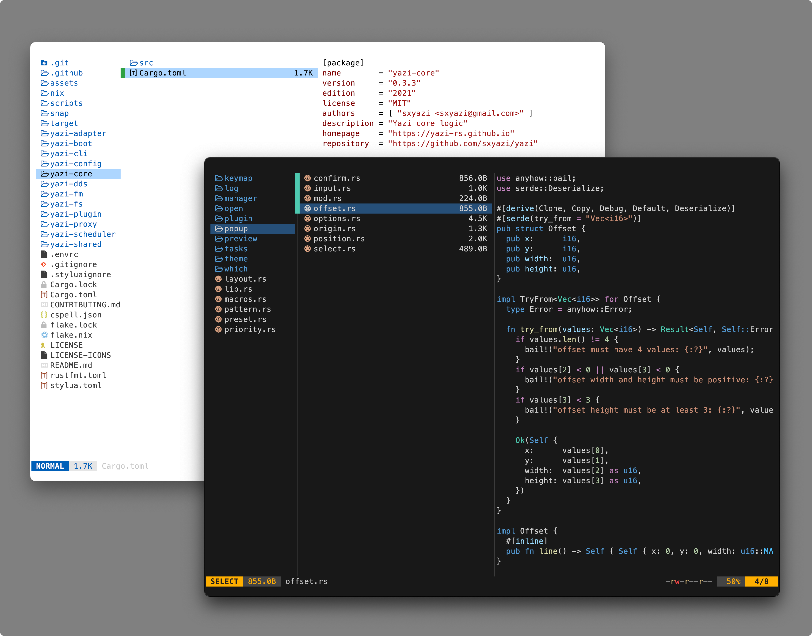

<div align="center">

<h3>
    vscode.yazi
</h3>
<p>
    <a href="https://github.com/sxyazi/yazi"> flavors</a> (themes) matching the <a href="https://code.visualstudio.com/">Visual Studio Code</a> default colors. Matches well with <a href="https://github.com/Mofiqul/vscode.nvim">vscode.nvim</a>
</p>
</div>

## Preview



<!-- TOC -->

_Screenshots can be found in `<theme>/img/*`_

- [Themes](./themes/) 
    - [vscode-dark-modern](https://github.com/956MB/vscode-dark-modern.yazi)
    - [vscode-dark-plus](https://github.com/956MB/vscode-dark-plus.yazi)
    - [vscode-light-modern](https://github.com/956MB/vscode-light-modern.yazi)
    - [vscode-light-plus](https://github.com/956MB/vscode-light-plus.yazi)

<!-- /TOC -->

## Installation

### Yazi CLI

1. Go to the repository of the flavor you want, like [vscode-dark-modern.yazi](https://github.com/956MB/vscode-dark-modern.yazi)

2. Run the following command to install the flavor as a yazi package:

```bash
# v25.5.28+
ya pkg add 956MB/vscode-dark-modern

# pre v25.5.28 (deprecated)
ya pack -a 956MB/vscode-dark-modern
```

3. Update your `~/.config/yazi/theme.toml` config to use the new theme.

```toml
[flavor]
use = "vscode-dark-modern"
# For Yazi 0.4 and above:
dark = "vscode-dark-modern"
```

### Manual

1. Clone the repository:

```bash
git clone --recurse-submodules https://github.com/956MB/vscode.yazi.git
```

2. Backup your current `theme.toml`:

```bash
cp ~/.config/yazi/theme.toml ~/.config/yazi/theme-backup.toml
```

3. Copy your desired flavor to the yazi `flavors` directory (create it if it doesn't exist):

```bash
cp -r vscode.yazi/themes/vscode-dark-modern.yazi ~/.config/yazi/flavors/
```

4. Update your `~/.config/yazi/theme.toml` config to use the new theme.

```toml
[flavor]
use = "vscode-dark-modern"
# For Yazi 0.4 and above:
dark = "vscode-dark-modern"
```

## Contributing

Feel free to open an [issue](https://github.com/956MB/vscode.yazi/issues) or [PR](https://github.com/956MB/vscode.yazi/pulls) if you have any suggestions or notice any issues with the colors.

## Shoutout

- [sxyazi/yazi](https://github.com/sxyazi/yazi) Terminal file manager
- [yazi-rs/flavors](https://github.com/yazi-rs/flavors) Yazi flavors repository
- [microsoft/vscode](https://github.com/microsoft/vscode) Visual Studio Code
- [Mofiqul/vscode.nvim](https://github.com/Mofiqul/vscode.nvim) Neovim colorscheme author

## License

[MIT LICENSE](./LICENSE)
